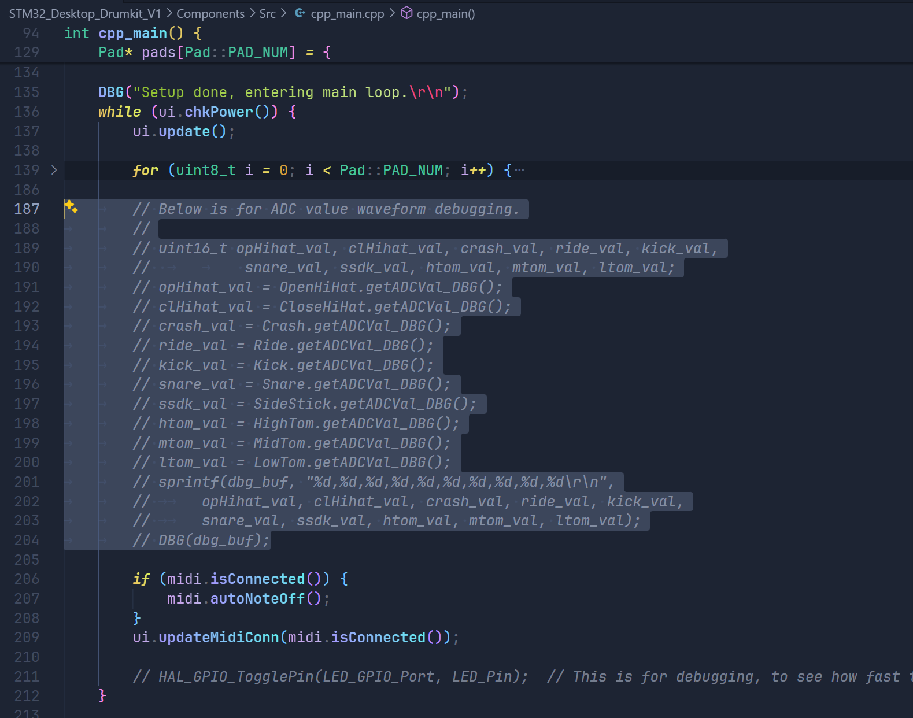
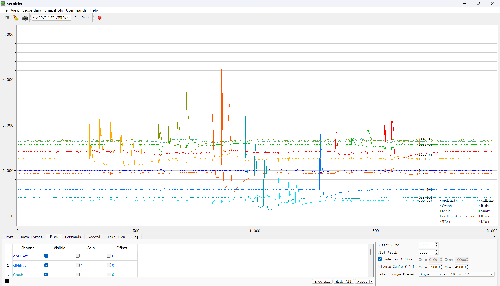
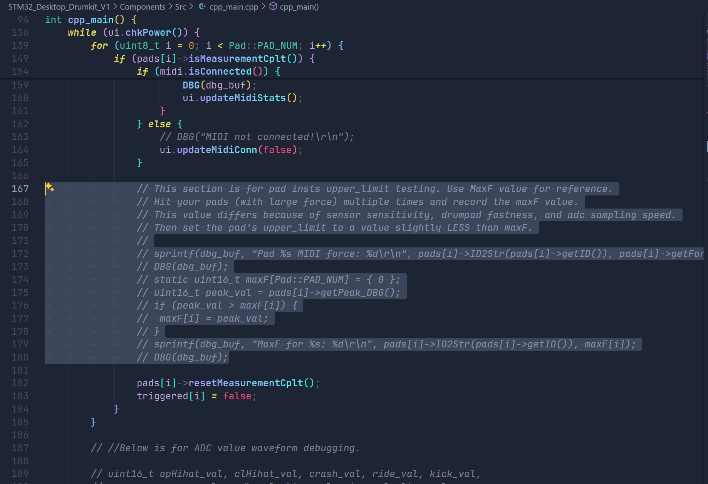
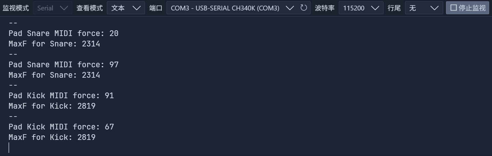

# STM32 Desktop Drumkit - 调试与参数标定指南

> 正式版本烧录前，请根据你鼓垫的实际情况微调代码。具体需要如下两次调试以及一次参数微调：

## 正式烧录前的代码调试

### 1. 检查鼓垫波形，确定基准值

- 注释掉`cpp_main.cpp`中while循环的整个for循环（或所有循环中的其他内容），取消注释189-204行的代码块。不需要管"unused variables"的警告。
    
- 烧录固件，烧录引脚顺序从左到右为：`SWCLK`、`SWDIO`、`GND`、`3V3`。
- 打开串口绘图仪(如SerialPlot等)，设置波特率为115200，选择正确的串口号，数据分割选择逗号。
- 接好鼓垫的Debug接口，长按按键开机，然后打开电脑串口。如果一切正常，你应该可以看到类似这样的波形，敲击某个传感器，可以看到0-4095范围内的变化：
    
- 你会发现存在轻微的鼓垫两两串扰现象，这是完全正常的，由STM32F4的ADC采样电容电荷滞留导致。
- **重要的是，请记录下每个传感器的静止基准ADC值，这些值决定Pad实例的`hit_threshold`成员变量。即使你没有串口绘图仪，也请打开串口助手记录这十个数字！！**

### 2. 检查鼓垫ADC峰值

- 还原代码到初始状态，然后取消注释`cpp_main.cpp`中172-180行的代码块。
    
- 烧录固件
- 打开串口助手，设置波特率为115200，选择正确的串口号。
- 接好鼓垫的Debug接口，长按按键开机，打开电脑串口，试着敲击某个传感器，你应该可以看到类似这样的输出：
    
- **请用不同力度，重复敲击每个传感器数十次，你会看到MaxF值记录下了所有敲击里出现过的最大峰值**。
- 记录下每个鼓垫的`MaxF`，这些值决定Pad实例的`upper_limit`成员变量。

## 正式烧录前的参数微调

你刚才得到了`hit_threshold`和`upper_limit`两个参数，现在可以开始微调代码了:
    
- 转到`cpp_main.cpp`中Pad实例化的位置，将`hit_threshold`中`+`号前面的数字替换为你得到的每个传感器的静止基准ADC值。
- 将`upper_limit`的值替换为你得到的每个鼓垫的`MaxF`值。**将此值设置成稍微低于MaxF的值，以得到更好的力度映射**。
- 如果你想的话，可以调整其他诸如`HIT_THRESHOLD_OFFSET`和`Pad::ForceMappingCurve`的值，以得到更好的触发效果和力度映射。
- 烧录固件，测试效果 ;)

## 其他值的微调 （可选）

- 可以尝试修改`midi.h`中的`NOTEOFF_DELAY_MS`，这个值用于延迟NoteOff事件。防止过快的NoteOn事件和NoteOff事件导致的音色跳跃。

- 可以尝试修改`pad.h`中的`ADC_MEASURING_WINDOW_MS`，此值是ADC采样窗口的长度，单位为毫秒。过短的窗口会导致ADC可能得不到精确的峰值，过长的窗口会导致响应延迟。

## 其他

我准备在之后的更新中优化代码结构，单独建立一个config文件，将参数和代码分离，方便用户修改。 :)
