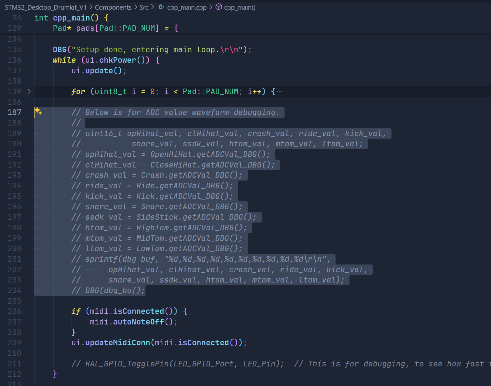
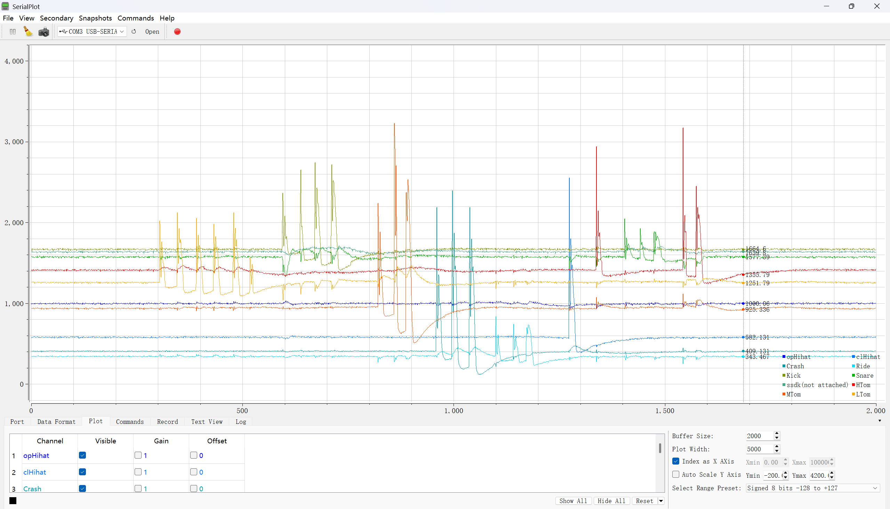
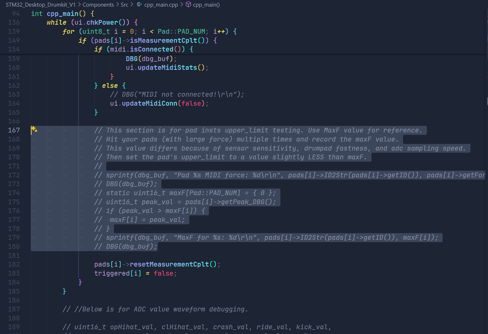
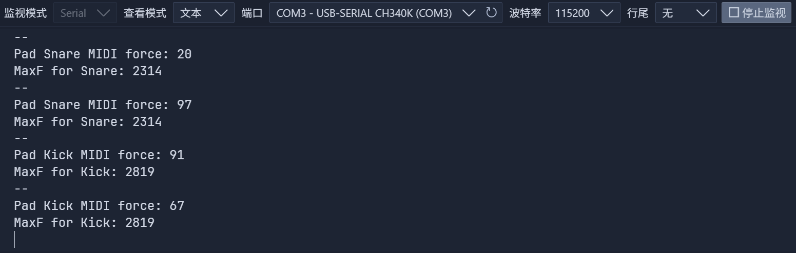

# STM32 Desktop Drumkit - Debugging and Calibration Guide

> Before flashing the final version, please fine-tune the code according to your actual drum pads. Two debugging steps and one parameter calibration are required:

## Code Debugging Before Final Flashing

### 1. Check Drum Pad Waveform and Determine Baseline Values

- Comment out the entire for loop (or all other content in the loop) in the while loop in `cpp_main.cpp`, and uncomment the code block on lines 189-204. Ignore the "unused variables" warning.
    
- Flash the firmware. The pin sequence for flashing from left to right is: `SWCLK`, `SWDIO`, `GND`, `3V3`.
- Open a serial plotter (such as SerialPlot), set baud rate to 115200, select the correct COM port, and choose comma as data separator.
- Connect the drum pad's Debug interface, long press the button to power on, then open the computer's serial port. If everything is normal, you should see a waveform like this. When hitting a sensor, you can see changes in the range of 0-4095:
    
- You will notice slight crosstalk between every two drum pads, which is completely normal and caused by the ADC sampling capacitor charge retention of STM32F4.
- **Most importantly, record the resting ADC value of each sensor. These values determine the `hit_threshold` member variable of the Pad instance. Even if you don't have a serial plotter, please open a serial terminal to record these ten numbers!!**

### 2. Check Drum Pad ADC Peaks

- Restore the code to its initial state, then uncomment the code block on lines 172-180 in `cpp_main.cpp`.
    
- Flash the firmware
- Open a serial terminal, set baud rate to 115200, select the correct COM port.
- Connect the drum pad's Debug interface, long press the button to power on, open the computer's serial port, try hitting a sensor, you should see output like this:
    
- **Hit each sensor dozens of times with different strengths, you will see the MaxF value records the maximum peak value that appeared in all hits**.
- Record the `MaxF` value for each drum pad. These values determine the `upper_limit` member variable of the Pad instance.

## Parameter Calibration Before Final Flashing

You have obtained the `hit_threshold` and `upper_limit` parameters, now you can start fine-tuning the code:
    
- Go to the Pad instantiation location in `cpp_main.cpp`, replace the number before the `+` sign in `hit_threshold` with the resting ADC value you obtained for each sensor.
- Replace the `upper_limit` value with the `MaxF` value you obtained for each drum pad. **Set this value slightly lower than MaxF to get better velocity mapping**.
- If you want, you can adjust other parameters such as `HIT_THRESHOLD_OFFSET` and `Pad::ForceMappingCurve` to get better triggering and velocity mapping.
- Flash the firmware and test the result ;)

## Other Parameter Adjustments (Optional)

- You can try modifying `NOTEOFF_DELAY_MS` in `midi.h`, this value is used to delay the NoteOff event. Prevents abrupt sound changes caused by too fast NoteOn and NoteOff events.

- You can try modifying `ADC_MEASURING_WINDOW_MS` in `pad.h`, this value is the length of the ADC sampling window in milliseconds. Too short a window may cause ADC to fail to get accurate peaks, too long a window will cause response delay.

## Others

I plan to optimize the code structure in future updates, create a separate config file to separate parameters from code, making it easier for users to modify.
