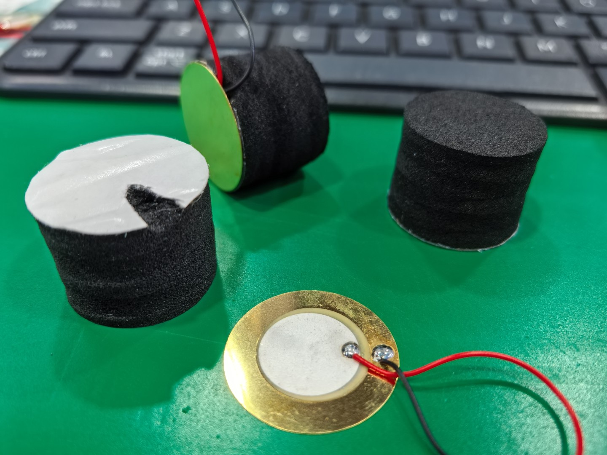
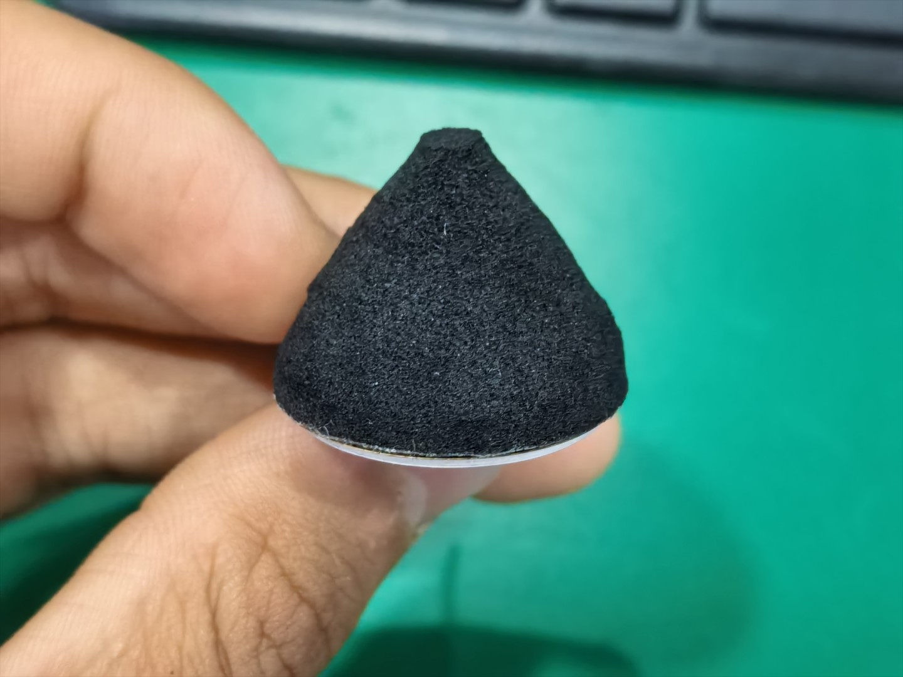
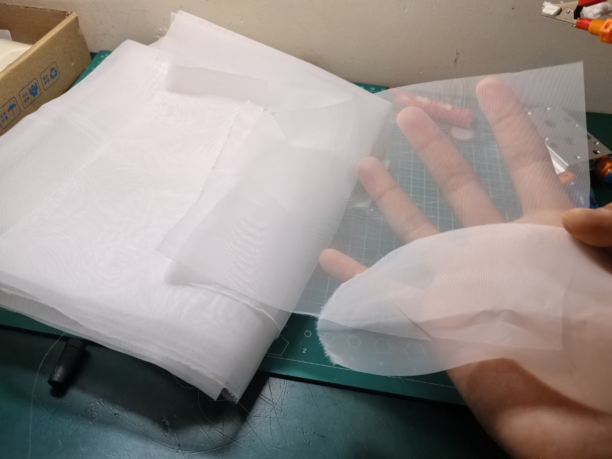
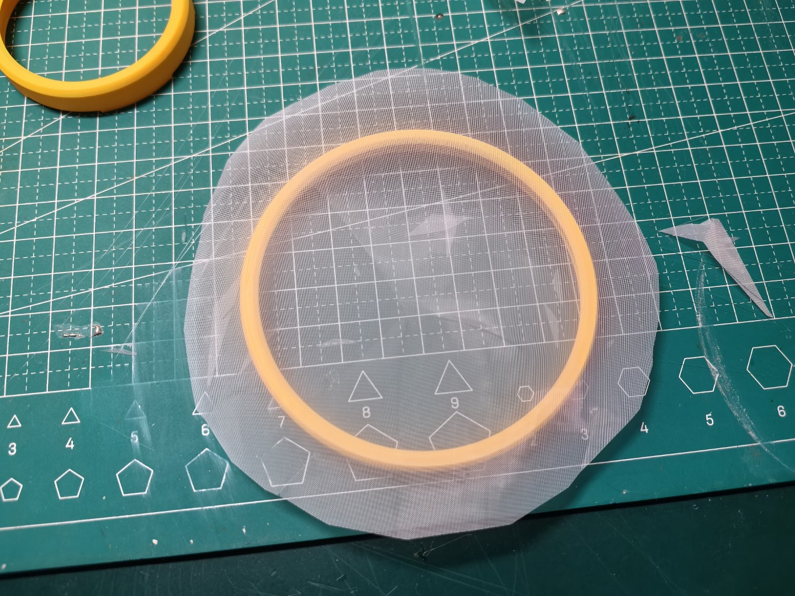
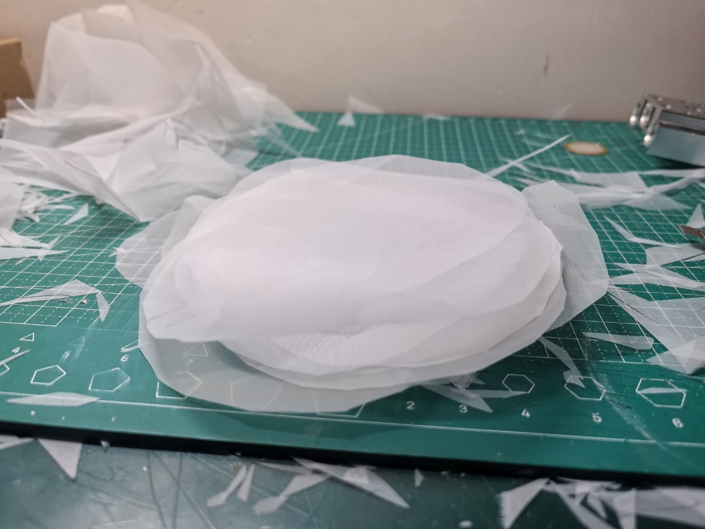
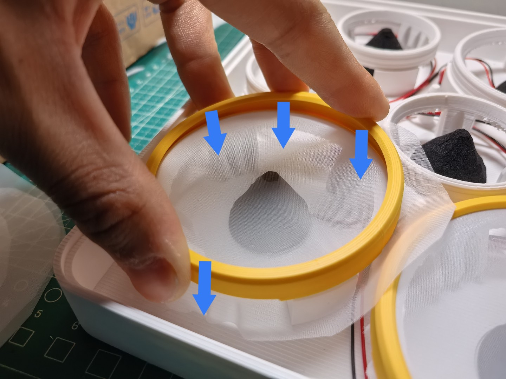
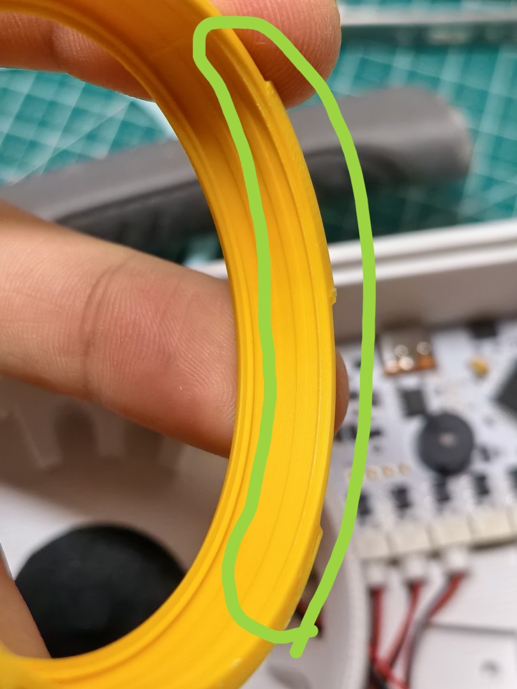
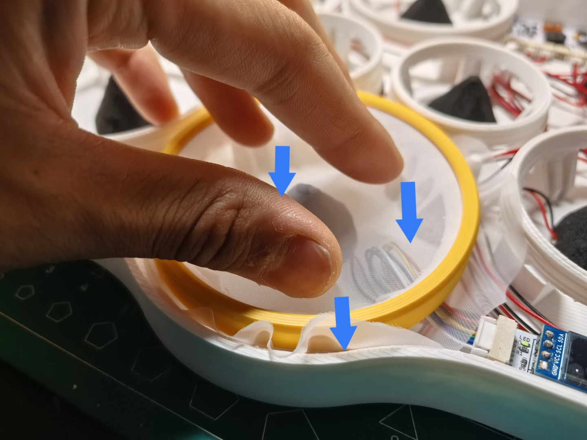
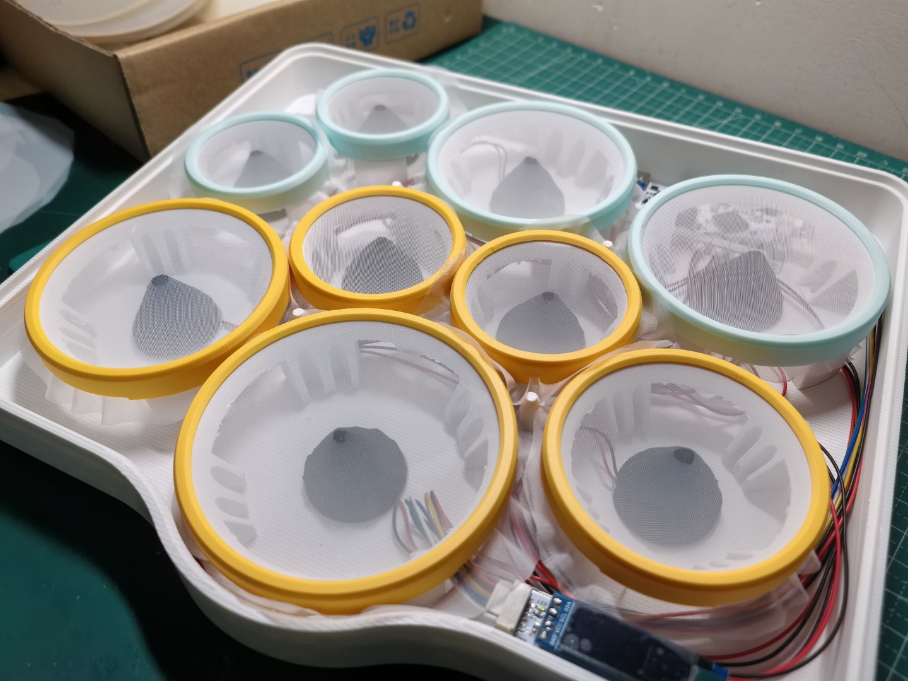
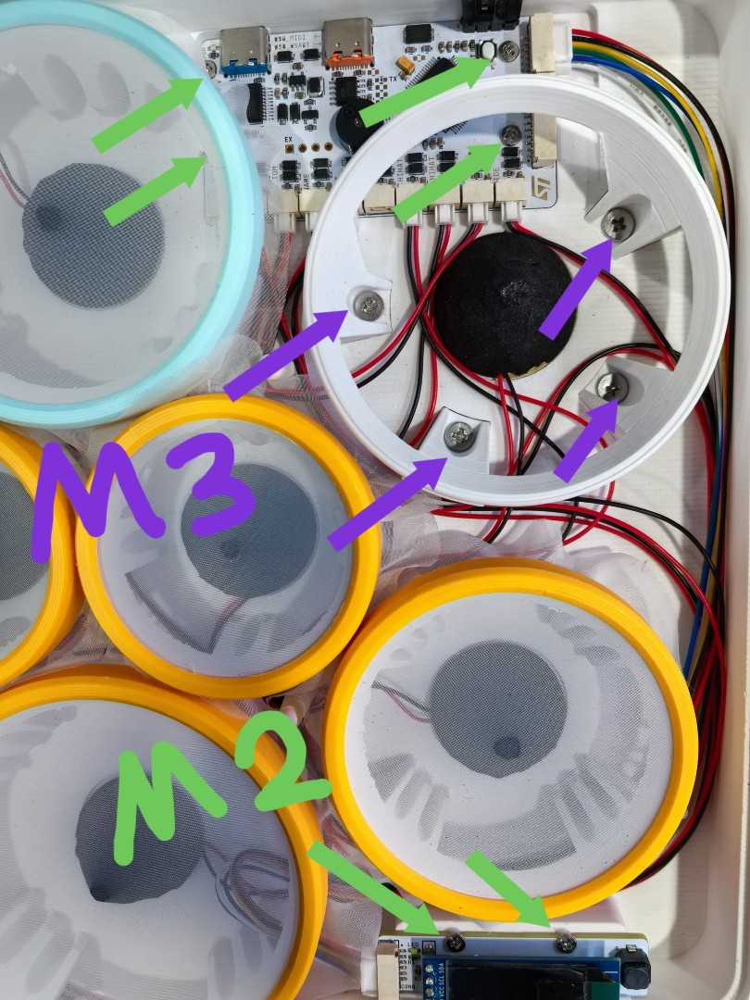

# STM32 Desktop Drumkit - 组装指南

> 如果你已经完成了PCB和3D打印的相关工作，那么恭喜你，可以进入好玩又赤鸡的组装环节力 ;)

## BOM

此清单是除了PCB外，还需要准备的组件清单。

| 名称 | 数量 |
| --- | --- |
| 压电陶瓷片 27mm (直径) | 9 |
| 电子鼓触发海绵柱28 * 20mm (直径 * 高) | 9 |
| 圆形泡沫双面胶 25 * 1mm (直径 * 厚) | >=9 |
| GH1.25 排线 6pin (双头**同向**) | 1 |
| GH1.25 排线 2pin (单头) | 10 |
| 若干其他线束 | - |
| PET 网布 120目左右 | 半米宽完全够 |
| M2 螺丝 (长度不应超过6mm) | 6 |
| M3 螺丝 (长度不应超过6mm) | 4 |
| 可能用到的胶水 | - |
| 镊子等工具 | - |

## 组装步骤

> 以下是组装步骤，请按照顺序和图示依次进行。步骤将会以“阶段小标题 - 一段文字一幅图”的形式呈现。

### 压电传感器制作 & 安装

1. 首先对压电片和电子鼓触发海绵柱进行预处理：
    - 压电片一定要检查白色陶瓷部分是否完整，示波器验证波形是否正常。
    - 海绵柱需要用工具在底部切出一个小槽，用于对齐压电片上的焊锡点，使压电片完全接触海绵底面。

2. 将压电片和海绵柱粘贴到一起，注意对齐焊点和小槽。
    

3. 将海绵柱用剪刀剪成锥状，顶面直径约4mm。
    

4. 将压电片线端焊接到GH1.25 2P线束上，**一定要注意GND和正极信号的位置，你以为的红色不一定就是正极，一定要先确认GH接头的方向和PCB上信号/GND的位置**，PCB上信号在左，GND在右。注意隔离。
    

5. 焊接完成后，即可将传感器接入主板。将UI板和主板通过6pin GH1.25 排线连接。
    

### 鼓面处理

1. 接下来处理鼓面。将PET网布裁成比紧固环大两圈的圆形。
    
    

2. 每个紧固环可以配两张网布，便于替换或是叠加安装。
    

3. 将这些剪好的网布拿去煮一下（5到10分钟），这是预收缩处理，可以改善长时间的网面塌陷问题。
    

### 鼓面安装和拆卸

1. 将剪好的网布放在对应位置，上方先对好紧固环的位置。
    

2. 使劲按压紧固环！直到紧固环和主体部分几乎无缝隙。这是一种过盈配合。
    
    
    *如果你发现紧固环太紧，请先略微打磨此环的位置，再进行安装：*
    

3. 完成！
    

4. 若要拆卸鼓面，直接稍稍用力按压网面即可，此时紧固环会直接翘起，再拔出即可。
    

5. 如果你发现紧固环不那么紧，或者网面仍然有点松弛，可以叠加安装网布。叠加安装需注意：两张网布之间最好呈45度角（0度或90度时，你可以看到网面叠加后看起来有摩尔纹一样的图案，45度则没有。）
    

### 最终组装

1. 这是完成所有鼓面安装后的效果。Ride是独立支架，鼓面应先不安装，不应该像图中一样已安装好，因为稍后需先固定支架：
    

2. 固定Ride支架以及电路板，按照图示固定相应的螺丝。
    
    

3. 盖上顶板。此时检查OLED屏幕和顶板是否贴紧。

### **完成！**

## 其他提示

- 你可以看到，主体底部有三个槽口，这是用以加装斜面支架的。有些时候你可能会希望使用棒子而不是手指来敲击，这时候用一个更斜的角度会更舒服。（斜面支架暂时未提供，稍后）

- 背部的两个接口，左侧为MIDI接口，右侧靠外的为串口调试口。
