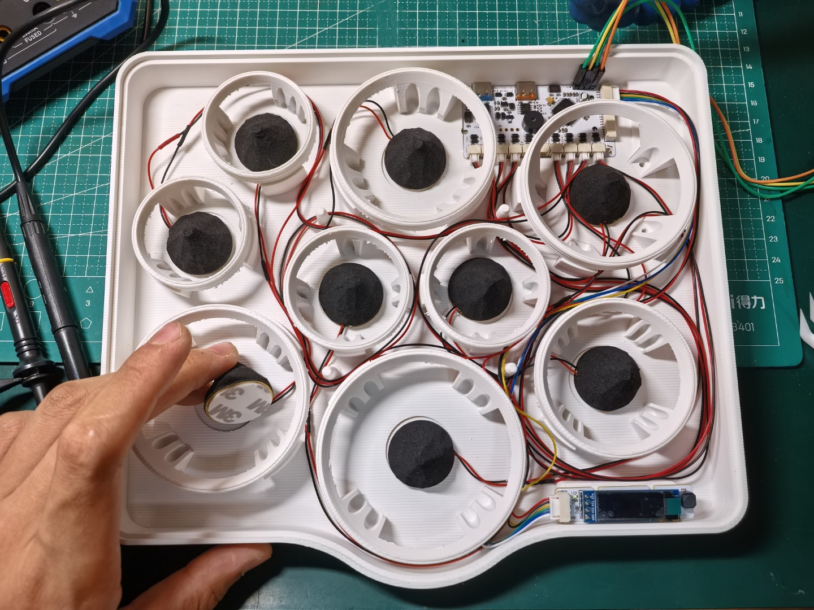

# STM32 Desktop Drumkit - Assembly Guide

> If you've completed the PCB and 3D printing work, congratulations! Now you can proceed to the fun and exciting assembly process ;)

## BOM

This is the component list needed in addition to the PCBs.

| Name | Quantity |
| --- | --- |
| Piezo sensor 27mm (diameter) | 9 |
| Drum trigger foam column 28 * 20mm (diameter * height) | 9 |
| Round foam double-sided tape 25 * 1mm (diameter * thickness) | >=9 |
| GH1.25 cable 6pin (dual-ended, same direction) | 1 |
| GH1.25 cable 2pin (single-ended) | 10 |
| Various other cables | - |
| PET mesh fabric 120 mesh | Half meter width is enough |
| M2 screws (length should not exceed 6mm) | 6 |
| M3 screws (length should not exceed 6mm) | 4 |
| Glue that may be needed | - |
| Tools like tweezers | - |

## Assembly Steps

> Below are the assembly steps. Please follow the order and illustrations. Steps will be presented in the form of "Section Title - A paragraph with one picture".

### Piezo Sensor Fabrication & Installation

1. First prepare the piezo sensors and drum trigger foam columns:
   - Check if the white ceramic part of the piezo sensor is intact, verify the waveform with an oscilloscope.
   - Cut a small groove at the bottom of the foam column to align with the solder points on the piezo sensor, ensuring full contact between the piezo and foam base.

2. Attach the piezo sensor to the foam column, aligning the solder points with the groove.
   

3. Cut the foam column into a cone shape with scissors, with top diameter about 4mm.
   

4. Solder the piezo wires to the GH1.25 2P cable. **Pay special attention to the GND and signal positive positions. The red wire may not necessarily be positive - verify the GH connector orientation and PCB signal/GND positions first.** On the PCB, signal is on the left, GND on the right. Ensure proper insulation.
   

5. After soldering, connect the sensors to the main board. Connect the UI board and main board using the 6pin GH1.25 cable.
   

### Drum Surface Preparation

1. Prepare the drum surfaces. Cut the PET mesh into circles slightly larger than the fastening rings.
   
   

2. Each fastening ring can be paired with two mesh pieces for replacement or layered installation.
   

3. Boil these mesh pieces (5-10 minutes) for pre-shrinking treatment, which helps prevent long-term surface sagging.
   

### Drum Surface Installation and Removal

1. Place the cut mesh pieces in position, aligning with the fastening rings.
   

2. Press the fastening rings firmly until there's almost no gap between the ring and main body. This is an interference fit.
   
   
   *If the ring is too tight, slightly sand the ring position before installation:*
   

3. Done!
   

4. To remove the drum surface, simply press the mesh slightly to lift the fastening ring, then pull it out.
   

5. If the ring isn't tight enough or the mesh still feels loose, you can install mesh pieces in layers. For layered installation: best to arrange two mesh pieces at a 45 degree angle (at 0 or 90 degrees you'll see moiré patterns, while 45 degrees avoids this).
   

### Final Assembly

1. This is the result after installing all drum surfaces. The Ride has a separate stand - its surface shouldn't be installed yet (unlike in this photo), as the stand needs to be fixed first:
   

2. Secure the Ride stand and circuit boards, fastening the appropriate screws as shown.
   
   

3. Install the top cover. Check if the OLED screen fits tightly with the cover.

### **Completed!**

## Additional Tips

- You'll notice three slots at the bottom of the main body - these are for installing angled stands. Sometimes you might prefer using sticks instead of fingers to play, in which case a more angled position would be more comfortable. (Angled stands not provided yet, coming soon)

- The two ports at the back: left is MIDI, right outer one is serial debug port.
