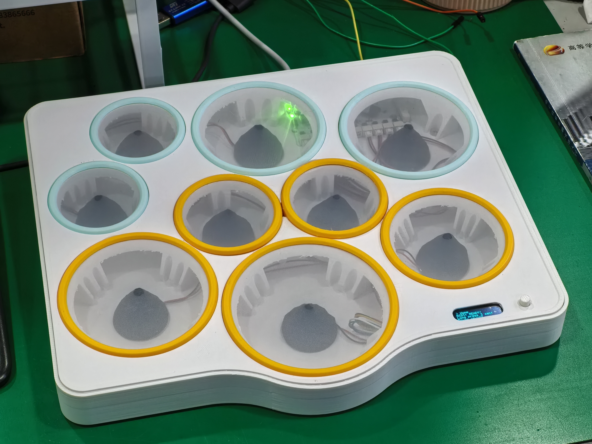
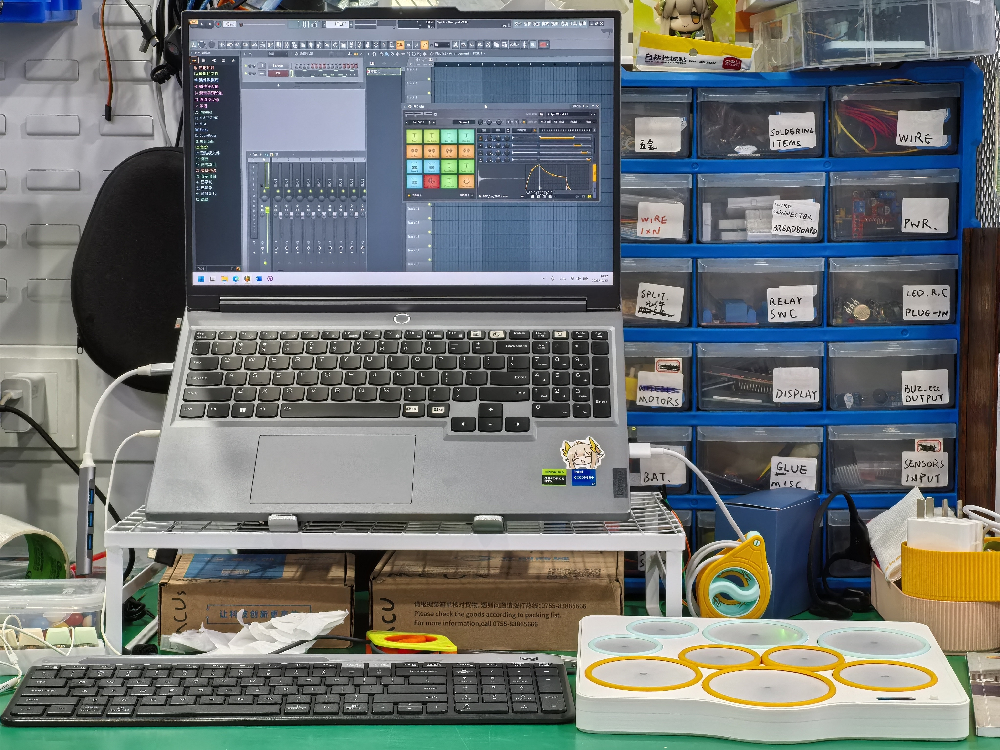

# STM32 Desktop Drumkit

> **Language/语言**: [English](README.md) | [简体中文](README-zh-CN.md)

这是README的中文版本。

## 项目简介

STM32 Desktop Drumkit 是一款基于 STM32 微控制器的多功能电子鼓垫系统，支持高精度击打采集、原生 MIDI 协议输出、实时 OLED 状态显示和多级菜单人机交互。系统包含 10 路鼓垫，采用压电传感器和多路 ADC+DMA 实现力度检测，内置自定义力度曲线（线性/对数/指数）、阈值灵敏度调节等。支持与 DAW、音源、电子乐器等无缝连接。

项目包含完整硬件原理图、PCB文件、固件代码、调试文档、组装指南等。此README文件提供了每个部分的独立文档链接，方便查阅。

视频演示：[Bilibili](https://www.bilibili.com/video/BV1LE4UzUE61/)

---

## 文档索引

- [硬件说明](Docs/hardware-zh-CN.md)
- [软件/固件 & API 说明](Docs/software-zh-CN.md)
- [组装指南](Docs/partsassemble-zh-CN.md)
- [调试与参数标定](Docs/howtodebug-zh-CN.md)
- [常见问题 FAQ](Docs/faq-zh-CN.md)

---

## 功能特性

- **多通道鼓垫采集**
- **高速 ADC 采样与峰值检测**
- **力度映射自定义**
- **标准MIDI信号发送**
- **OLED状态显示和多级菜单系统**

---

## 快速开始

1. 参照 [硬件说明](Docs/hardware-zh-CN.md) 进行元器件选购、PCB焊接、硬件电路检查与调试，以及3D外壳打印
2. 按照 [组装指南](Docs/partsassemble-zh-CN.md) 完成各部分硬件组装（包括压电传感器接入）
3. 注意 [软件/固件 & API 说明](Docs/software-zh-CN.md) 内的说明，下载并烧录固件，连接 MIDI 接口至电脑或其他 MIDI 设备
4. 上电后，按钮长按开机，OLED 会显示欢迎界面并进入Home页，此时
5. 按照 [使用与调试指南](Docs/howtodebug-zh-CN.md) 完成参数标定和测试

---

## 硬件说明

- **主控芯片**：STM32F405RGT6
- **压电陶瓷片**：推荐 27mm，每路信号线建议使用双绞或加屏蔽
- **ADC采样**：12位精度，多路复用
- **OLED显示**：128x32分辨率，I2C接口
- **其他**：LED、蜂鸣器、按键，外设接口见硬件原理图

---

## 源码结构

- `cpp_main.cpp/h` : 主程序入口，主循环、Pad/MIDI/UI 初始化与调度
- `pad.cpp/h` : 鼓垫采集与检测、力度映射和参数管理
- `midi.cpp/h` : MIDI 通信协议、信号发送、自动 Note Off、连接检测
- `oled.cpp/h` : OLED 屏驱动、文本/变量/图形显示
- `OneButtonTiny.cpp/h` : 单按钮多模式输入检测（单击/双击/长按/多击）
- `ui.cpp/h` : 用户界面与菜单系统管理

---

## 鸣谢

- 感谢[MoraiYanKele](https://github.com/MoraiYanKele)提供他的OLED多级菜单库
- 感谢Matthias Hertel的Arduino Onebutton库，本项目移植了其部分功能
- 本项目最初受 [Victor2805/Homemade-electronic-drum-kit-with-arduino](https://github.com/Victor2805/Homemade-electronic-drum-kit-with-arduino) 的灵感启发
- 感谢我热爱打击乐器以及DAW经验丰富的表哥，他对原型提出了很多修改建议 @[Woodbreeze](https://github.com/WoodBreeze) ;)
- 感谢所有开源库作者与DIY社区分享经验

---

**WilliTourt / 2025.10 V1版本发布**
