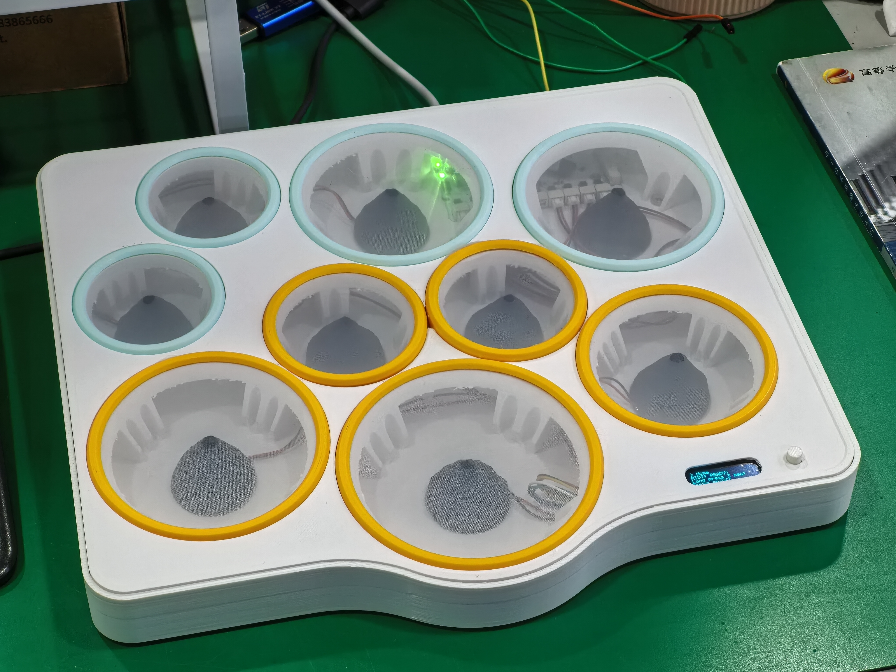
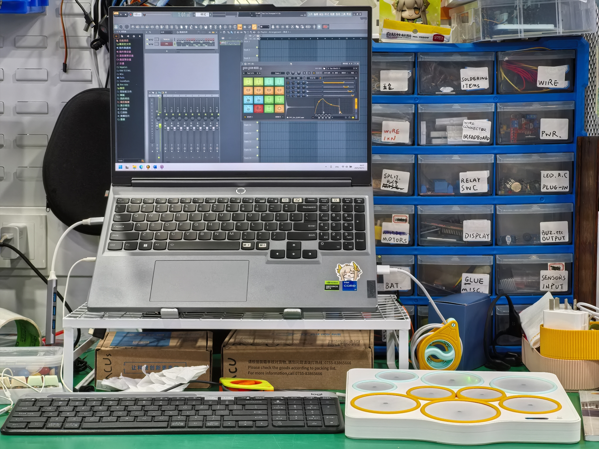

# STM32 Desktop Drumkit

> **Language/语言**: [English](README.md) | [简体中文](README-zh-CN.md)

This is the English version of the README.

## Project Overview

STM32 Desktop Drumkit is a multifunctional electronic drumpad system based on STM32F4 microcontroller, supporting high-precision hit detection, native MIDI protocol output, real-time OLED status display, and multilevel menu human-machine interaction. The system includes 10 drum pads, using piezoelectric sensors and multi-channel ADC+DMA to achieve force detection, built-in customizable force curves (linear/logarithmic/exponential), threshold sensitivity adjustment, etc. It supports seamless connection with DAW, sound sources, electronic instruments, etc.

The project includes complete hardware schematics, PCB files, firmware code, debugging documents, assembly guides, etc. This README file provides independent document links for each section, making it easy to access.

Video demo: [Bilibili](https://www.bilibili.com/video/BV1LE4UzUE61/)

---

## Document Index

- [Hardware Design](Docs/hardware.md): Introduce the hardware design related to STM32 Desktop Drumkit, as well as the explanations related to PCB soldering and 3D part printing.
- [Software/Firmware/API Description](Docs/software.md)
- [Assembly Guide](Docs/partsassemble.md): A detailed illustrated guide on how to assemble STM32 Desktop Drumkit.
- [Debugging and Calibration Guide](Docs/howtodebug.md): This document guides you on how to calibrate parameters and conduct tests, etc.
- [FAQ](Docs/faq.md)

---

## Features

- **Multichannel drum pad detection**
- **High-speed ADC sampling and peak detection**
- **Customizable force mapping**
- **Standard MIDI signal transmission**
- **OLED status display and multilevel menu system**

---

## Quick Start

1. Refer to the [Hardware Description](Docs/hardware.md) for component procurement, PCB soldering, hardware circuit inspection and debugging, and 3D case printing.
2. Follow the [Assembly Guide](Docs/partsassemble.md) to complete hardware assembly. (Piezo sensor connection is also included in this step)
3. [Software/Firmware & API Description](Docs/software.md) Check this out, burn the firmware, connect the MIDI interface to the computer or other MIDI devices.
4. After powering on, press and hold the button to turn on the device, the OLED will display the welcome screen and enter the Home page.
5. Follow the [Debugging and Calibration Guide](Docs/howtodebug.md) to complete parameter calibration and testing.

---

## Hardware Description

- **Main Controller**: STM32F405RGT6
- **Piezoelectric Ceramic Disc**: Recommended 27mm, it is advised to use twisted pairs or shielded cables for each signal line.
- **ADC Sampling**: 12-bit precision, multiplexed
- **OLED Display**: 128x32 resolution, I2C interface
- **Others**: LEDs, buzzer, buttons, see the hardware schematic for peripheral interfaces.

---

## Source Code Structure

- `cpp_main.cpp/h` : Main program entry, main loop, Pad/MIDI/UI initialization and scheduling
- `pad.cpp/h` : Drum pad detection, force mapping, and parameter management
- `midi.cpp/h` : MIDI communication protocol, signal transmission, automatic Note Off, connection detection
- `oled.cpp/h` : OLED screen driver, text/variable/graphic display
- `OneButtonTiny.cpp/h` : Multimode input detection for a single button (single click/double click/long press/multi-click)
- `ui.cpp/h` : User interface and menu system management

---

## Plans / Changelog (Since 2025.10.14)

- [ ] Complete documentation
- [ ] Optimize UI interface
- [ ] Complete LED/BUZZER functionality
- [ ] Complete DebugLog feature
- [ ] Add PadTest feature
- [ ] Add PadSettings fine-tuning parameters
- [ ] Add Output related features
- [ ] Add SSTK sensor support

...

---

## Acknowledgments

- Thanks to [MoraiYanKele](https://github.com/MoraiYanKele) for providing his OLED multilevel menu library.
- Thanks to Matthias Hertel's Arduino Onebutton library, part of its functionality has been ported to this project.
- This project was initially inspired by [Victor2805/Homemade-electronic-drum-kit-with-arduino](https://github.com/Victor2805/Homemade-electronic-drum-kit-with-arduino).
- Thanks to my cousin who loves percussion instruments and is experienced with DAW, he provided many modification suggestions for the prototype @[Woodbreeze](https://github.com/WoodBreeze) ;)
- Thanks to all the authors of the open-source libraries and the DIY community for sharing their experiences.

---

**WilliTourt / 2025.10 V1 Release**
